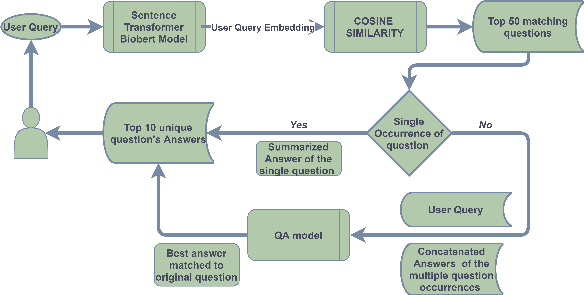

### Tibot Social Media QA Retriever ###
- This is the primary repository containing all the preprocessing scripts and notebooks for the QA retriver.

#### How does it work???
- From user's perspective:
  1. User inputs a query, the system returns top 10 related answers to the query.:astonished::exclamation: \
  \

- What's happening underneath? :grey_exclamation::grey_question:
  1. The app returns answers related to user query from a pool of scraped and preprocessed social media posts and comments from relevant skin condition community.
  2. The app is divided into two major parts:
		- Finding unique similar questions based on **COSINE** similarity on BERT embeddings.
		- Choosing best answer from all possible answers for each unique questions with the help of a QA model.
  3. **Dataset Description**
		- Currently we have implemented the application for **TWO(2)** skin conditions; **Eczema** and **Psoriasis**. The Social media Q&A pairs are scraped from corresponding Facebook group , Reddit threads, Quora posts, Healthtap, WebMD, E-Healthforum, Iclinic, AskDocs ect. forum posts and threads. \
		  The number of Q&A pairs for each skin condition is:
		  1. Eczema = 31504
		  2. Psoriasis = 42723
  4. **Data Preprocessing:**
		- The app requires a lot of preprocessing of the data beforehand. As mentioned , the main sources of data are Facebook, Reddit and Quora post related to the skin condition and corresponding comments to the posts. These data are restructured and unnecessary posts are filtered off. For these two task the notebooks **data_process.ipynb** and **filter_qna.ipynb** are used.
        - As prerequisit of the app, we need to collect the BERT embedding for all the  questions and answers using the colab notebook
named **Extract biobert embeddings.ipynb** . The embeddings are needed to be loaded at runtime.
		- Another preprocessing task performed beforehand is removing any names present in the post and comments in our dataset and summerizing the answers using a NLP model. This task can be achieved by the colab notebook named **Answer summarization.ipynb** and **name removal and summarization tests.ipynb**. All the notebooks can be found in github repository.
  
  5. **App Inner Workings:** 
		1. There are two NLP models used in the app to [extract embedding](https://huggingface.co/gsarti/biobert-nli) and to [find best answer](https://huggingface.co/mrm8488/bert-small-2-finetuned-squadv2). Both of these models are backed up in our cloud storage [here.](https://storage.cloud.google.com/tibot-adnan/qa_files/models/models.zip?cloudshell=false)
		2. The app takes the user's query and passes it through the 1st model to extract biobert embedding.
		3. Then it uses cosine similarity to find top 50 matching questions using the preprocessed and pre-extracted question embeddings. The reason behind choosing top 50 questions is the **multiple occurrence** of some questions. 
		4. Then the app fetches the answers to the top questions and here's where the QA model comes into play.
		5. As previously mentioned, there are a few questions that are present multiple times in our dataset. So we aggregate all the answers to the same question and pass that as context string to the QA model alongside the user's question. The model gives us the most appropriate answer for the question for given context. If there is only one occurrence of a best matched question, then the original answer is returned.
		6. Step **5** is repeated for top 10 unique questions and top 10 answers are returned as the response of the app.
		7. The app is designed modularly so the same funtions are called for all disease endpoints with corresponding embedding files.
  6. **Technologies Used:**
		1. [Sentence-Transformer](https://github.com/UKPLab/sentence-transformers) and Scipy's [Spatial Distance](https://docs.scipy.org/doc/scipy/reference/spatial.distance.html) is used to perform semantic search using **COSINE** similarity. An alternative for scipy is [FAISS](https://github.com/facebookresearch/faiss/wiki) for computing cosine similarity. As we are performing single similarity search, the performance advantage is miniscule for FAISS (confirmed after exhaustive testing with our app modules). FAISS would work well with [large number](https://arxiv.org/abs/1702.08734) of vectors and batch-search scenarios.
		2. [HuggingFace Transformers(based on pytorch)](https://github.com/huggingface/transformers) is used for the QA model with the weights mentioned earlier.
		3. The models are served using a backend created by using [FastAPI](https://github.com/tiangolo/fastapi) asynchronus python web framework.
		4. The application is containerized using docker and docker-compose and the base docker image is [tiangolo/uvicorn-gunicorn-fastapi:python3.6-2020-06-06](https://github.com/tiangolo/uvicorn-gunicorn-fastapi-docker) .
  7. **Skin Conditions Covered:**
		- [x] Eczema :thumbsup:
        - [x] Psoriasis :thumbsup:
		- [ ] Acne (Will be implemented soon) :point_left:
###### Authored by:

Md.Adnan Taufique:neckbeard: \
Machine Learning Engineer\
Polyfins Technology Inc.

	